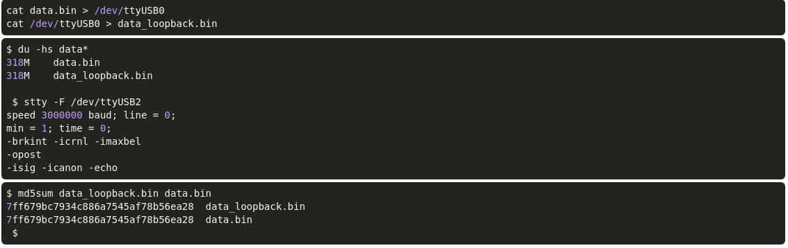

Implements an uart on blackicemx fpga! But the code is portable! The top module realizes a loopback.
I was able to run 3000000 Baud error free Prolific Technology, Inc. PL2303 Serial Port!

Loopback runs in this szenario: PC<->usb<->uart<->fpga

